# docker-lab
Repo para la realización del laboratorio de Docker del curso INTRODUCCIÓN A DEVOPS. SEGUNDA EDICIÓN. (262922GE160)

## Ejercicio 1 - Creando imágenes
### Paso 1
1. Lo primero que hago es abrir "Docker Desktop" y en el apartado "Docker Hub" busco la imagen "ubuntu" para poder crearme un contenedor en base a esa imagen. Elijo la imagen mas descargada, la primera que me sale. En la parte inferior derecha de "Docker Desktop" pincho en el apartado "terminal". 
2. Ejecuto el comando:

   ```docker run -it ubuntu /bin/bash```

   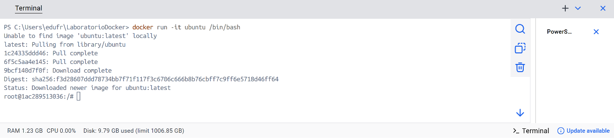
   
4. Instalo "cURL" dentro del contenedor (ya que la imagen base no lo trae), ejecutando el comando:

   ```apt-get update && apt-get install -y curl```

   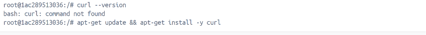

6. Y finalmente compruebo que se ha instalado correctamente ejecutando el comando:

   ```curl --version```

   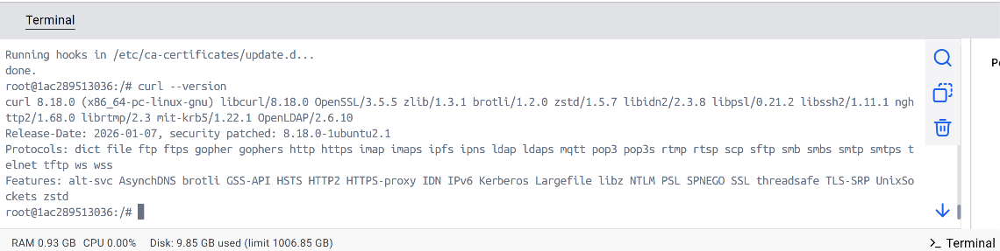

#### Pregunta
¿Con qué comando podrías guardar los cambios del contenedor como una nueva imagen?
Para guardar los cambios de este contenedor como una nueva imagen, tengo que salir del contenedor escribiendo `exit` y ejecutar el siguiente comando en la terminal (fuera del contenedor): `docker commit 1ac289513036 ubuntu-con-curl` en la que el código que hay después de la palabra `commit` sería el ID del contenedor y a continuaciñón iría el nombre de la nueva imagen.

### Paso 2
1. Abro "Visual Studio Code" y dentro del directorio de trabajo me creo un "Dockerfile".
2. Creo la nueva imagen con el comando:

  ```docker build -t mi-ubuntu-curl``` 

  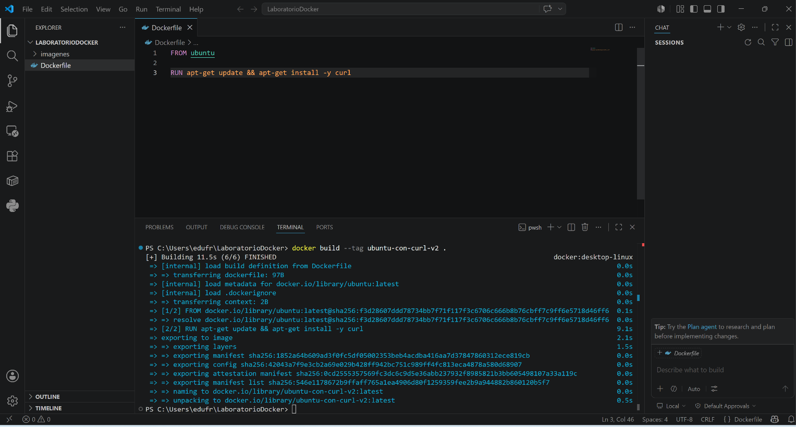

4. Compruebo que funciona:

   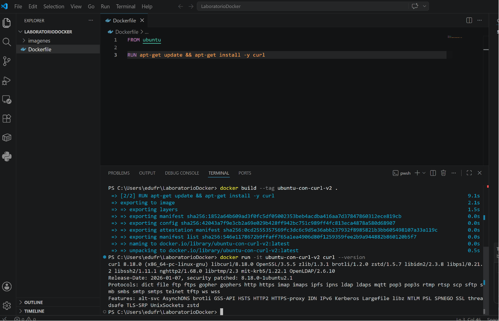

#### Pregunta
¿Qué comando permite ver las capas de una imagen Docker?  
El comando para ver las capas de una imagen en Docker es `docker image history`, en mi caso sería:

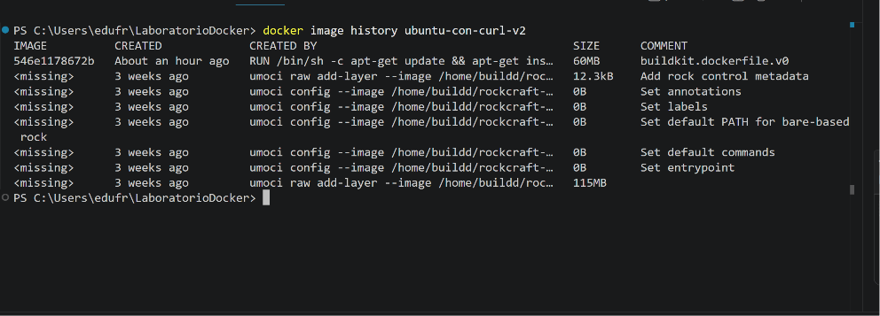

## Ejercicio 3 - Volúmenes persistentes

### Paso 1 - Crear el volumen y ejecutar el contenedor
1. Primero, crearemos un volumen llamado "mi_volumen_ejercicio3" y arrancaremos el contenedor:

   ```docker volume create mi_volumen_ejercicio3```

   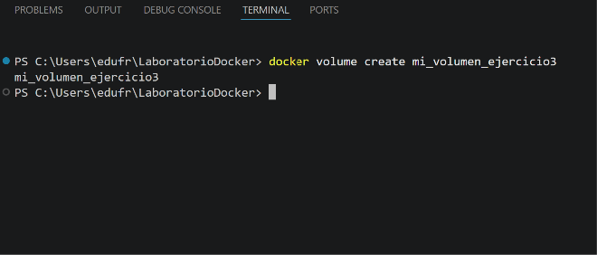

2. Ejecutamos el contenedor basado en "postgres:17" haciendo uso de `--detach` (en segundo plano) y añadiendo una contraseña con el flag `-e` (lo exige la imagen oficial de postgres).
   
   ```docker run --name mi_postgres_ejercicio3 -e POSTGRES_PASSWORD=mi_clave -v mi_volumen_ejercicio3:/var/lib/postgresql/data --detach postgres:17```

   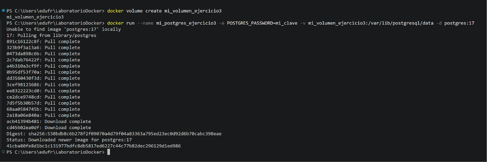

3. Nos conectamos a la BBDD y creamos la tabla, para entrar a la terminal de PostgreSQL (psql) dentro del contenedor que está corriendo, uso `docker exec`:

   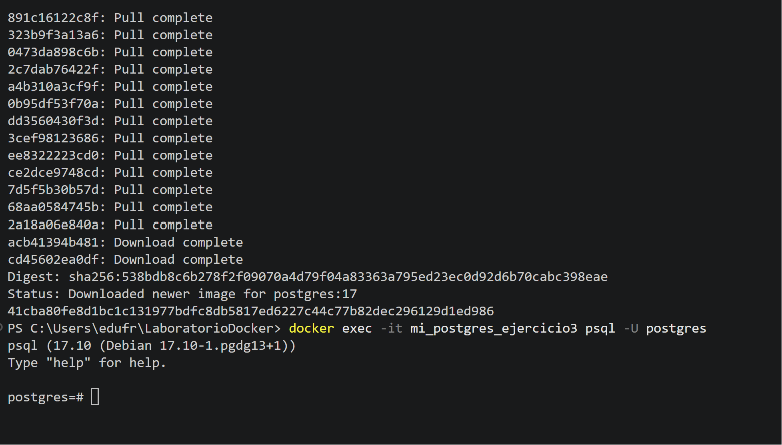
   
4. Una vez dentro de la consola de Postgres (se ve el prompt `postgres=#`). Ejecuto los comandos SQL del ejercicio:

   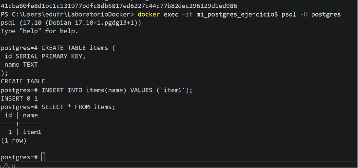

5. Ahora detenemos y destruimos el contenedor:

   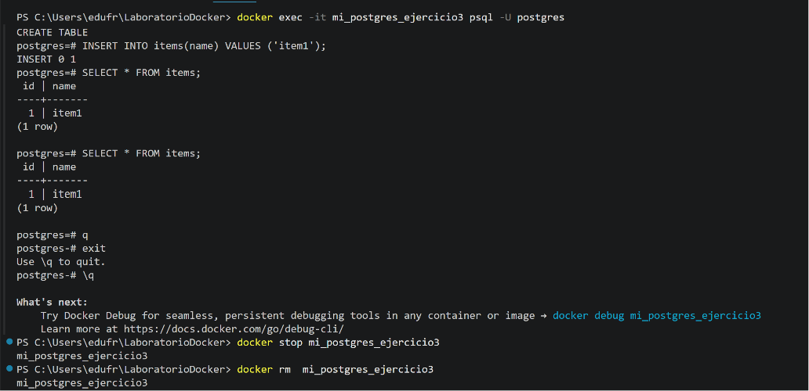

6. Vamos a crear un contenedor completamente nuevo (le llamaremos "mi_nuevo_postgres"), pero le conectaremos el volumen "mi_volumen_ejercicio3" que guardó los datos del contenedor anterior:     

   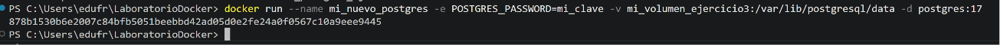

7. Ahora vamos a comprobar que los datos siguen existiendo, me conecto al nuevo contenedor usando "postgres" para verificar si la tabla y el registro sigue existiendo:

   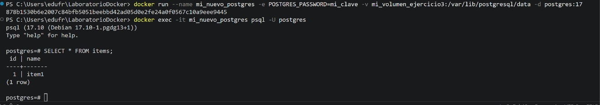

## Ejercicio 4 - Bind mounts 
1. Creo el archivo ".html" en mi máquina con el contenido:

   ```<h1>Hola Docker</h1>```

2. Ejecuto el contenedor de "nginx" con el "Bind Mount" abriendo la terminal dentro de la misma carpeta donde guardé mi "index.html" y ejecutando el siguiente comando:

   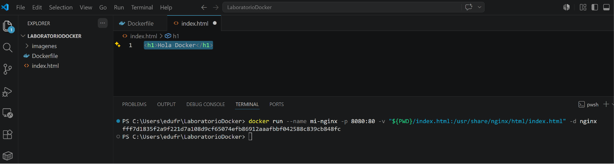

   Con la opción `-v` estoy reemplazando el archivo por defecto de "nginx" por mi "index.html" local.
3. Abro mi navegador web e ingreso la dirección `http://localhost:8080` y veo una pantalla blanca con el título "Hola Docker".

   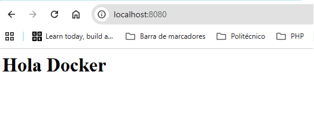

#### Pregunta
¿Qué ocurre si modificas el archivo "index.html" en tu máquina?     
Los cambios se reflejan de forma inmediata dentro del contenedor porque con los "bind mounts", Docker no hace una copia del archivo; crea un "enlace directo" (un acceso directo real). El contenedor está leyendo el archivo directamente desde el disco duro de mi propia máquina

## Ejercicio 6 - Creando redes privadas
1. Primero creo la red privada, una red a la que llamo "my-net":

   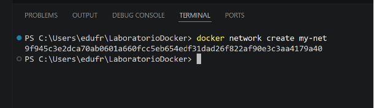

2. Ahora arranco los dos contenedores Ubuntu. Para que los contenedores de Ubuntu no se apaguen inmediatamente (ya que no tienen ningún servicio ejecutándose de fondo), debemos arrancarlos en modo interactivo y en segundo plano usando los flags `-dit`:

   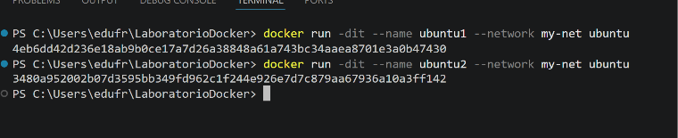

3. Instalo "ping" en el primer contenedor. Por defecto, las imágenes oficiales de Ubuntu en Docker vienen minimizadas para pesar lo mínimo posible, así que no traen la herramienta "ping". Vamos a entrar al primer contenedor para instalarla:

   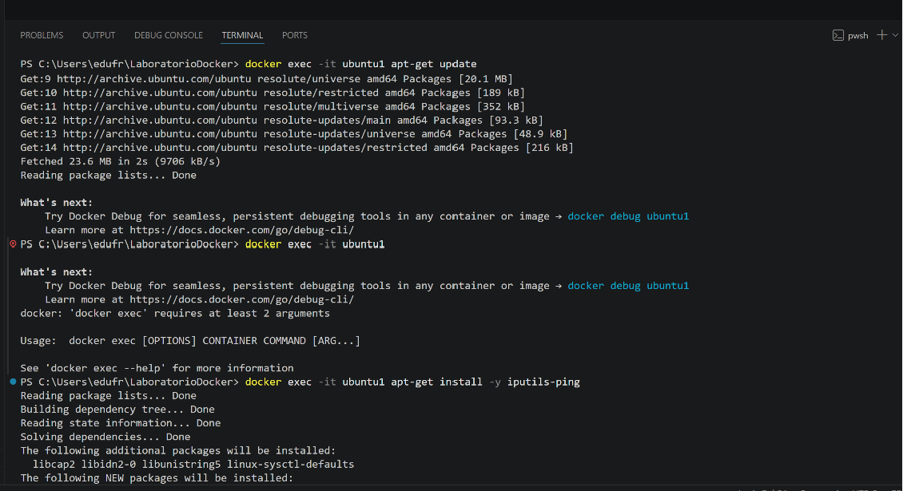

4. Ahora que "ubuntu1" ya tiene "ping", vamos a pedirle que intente comunicarse con "ubuntu2" usando su nombre:

   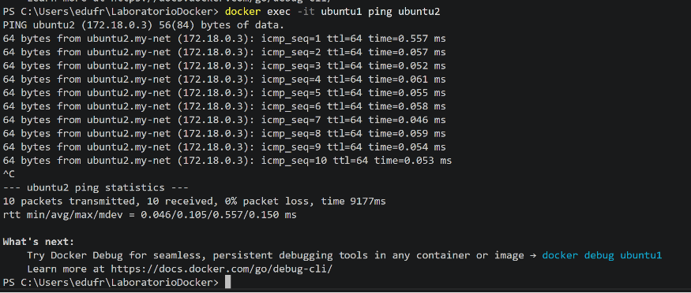

#### Pregunta
¿Los contenedores pueden comunicarse entre sí?
Sí, se comunican perfectamente. Al ejecutar el comando "ping" "ubuntu2", verás que "ubuntu1" recibe respuesta de inmediato. Al crear una red privada personalizada "my-net", Docker activa automáticamente un servidor DNS interno. Este servidor mapea el nombre de cada contenedor con su IP privada de forma dinámica

## Ejercicio 9 - Docker Compose --- Compartiendo volúmenes
1. Creo el archivo `docker-compose.yml` con el siguiente código:

   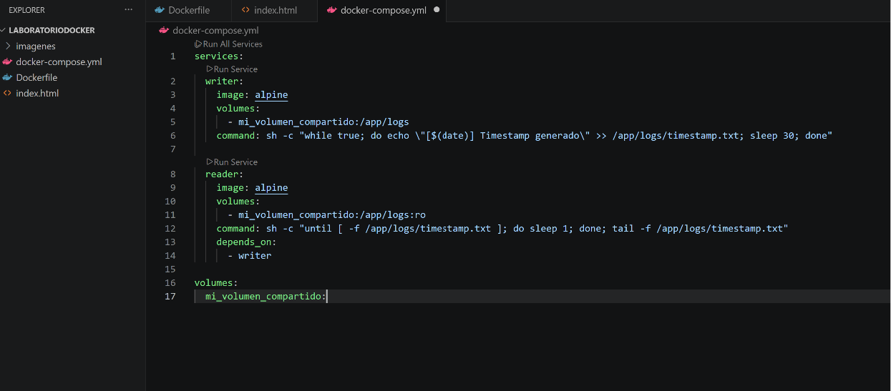

Explicación:
 - `volumes`: (al final del archivo): Declaramos un volumen compartido llamado "mi_volumen_compartido". Docker se encargará de crearlo automáticamente en el sistema.
 - Servicio `writer`:
   - Usa una imagen muy ligera (alpine).
   - Monta el volumen en la ruta `/app/logs` (con acceso total de lectura y escritura por defecto).
   - `command`: Ejecuta un bucle infinito que cada 30 segundos escribe la fecha y hora actual (date) dentro del archivo `timestamp.txt`.
- Servicio `reader`:
   - Usa la misma imagen ligera (alpine).
   - Monta el mismo volumen, pero añadiendo al final de la ruta: `:ro` (significa Read-Only o Solo Lectura). Si este contenedor intentara modificar el archivo, Docker se lo denegaría.
   - `command`: Espera un momento a que el archivo exista (para evitar errores de arranque) y luego ejecuta un `tail -f`, que se queda "escuchando" el archivo y muestra en la consola todo lo que se vaya escribiendo en él en tiempo real.
   - `depends_on`: Le dice a Docker que arranque primero el contenedor writer.
 
2. Ahora ejecuto el archivo `docker-compose.yml` y compruebo que funciona:

   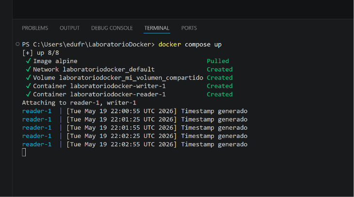
